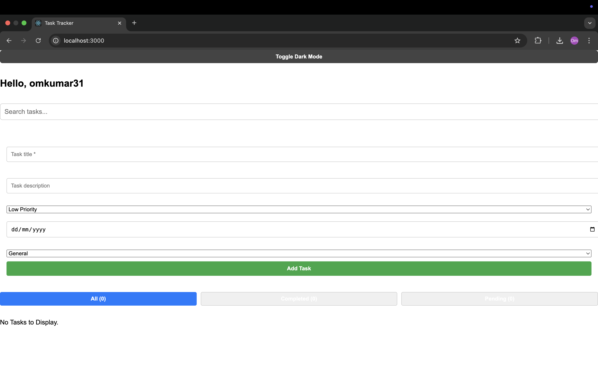
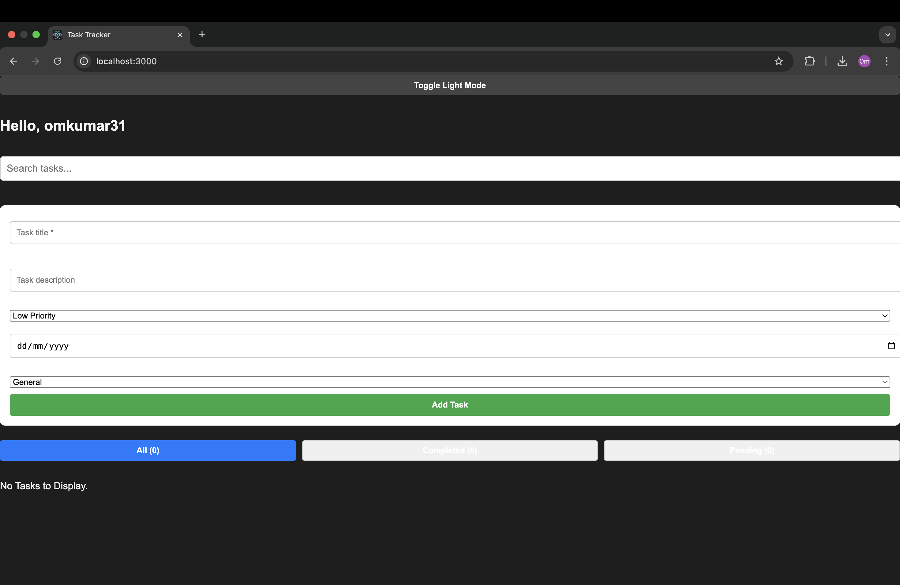

# Personal Task Tracker

## 📖 Description
A responsive and intuitive task management application built with React.js. This app allows users to add, edit, delete, filter, and search tasks with additional features like task priority, due dates, category tags, dark mode, and persistent storage.

---

## 🚀 Features
- 🔐 Simple login with username stored in `localStorage`
- 📝 Add, edit, delete tasks with confirmation
- ✅ Mark tasks as completed or pending
- 🕒 Displays task creation date and due date
- 🎯 Task priority levels (Low, Medium, High)
- 🏷️ Task categories/tags (Work, Personal, Urgent, etc.)
- 🔍 Real-time search functionality
- 📂 Filter tasks by All, Completed, and Pending
- 💾 Persistent task storage using `localStorage`
- 🌙 Dark mode toggle
- 🎞️ Smooth UI transitions and animations
- 📱 Fully responsive (mobile + desktop)

---

## 🛠 Setup Instructions

1. Clone the repository
   ```bash
   git clone https://github.com/your-username/personal-task-tracker.git

## 🖼 Screenshots

### 🔆 Light Mode


### 🌙 Dark Mode

